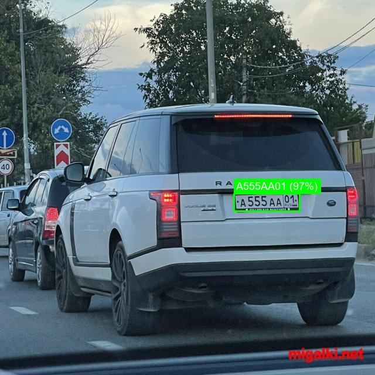
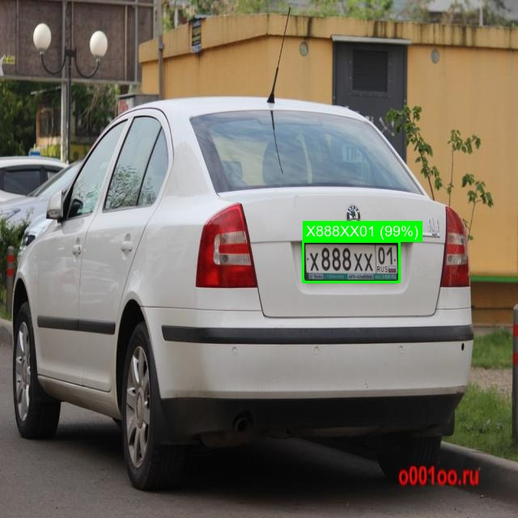

# ParkVision 🚗

Система автоматического распознавания автомобильных номерных знаков на видеопотоке и изображениях. Разработана для использования на парковках и КПП.

## Возможности

- Детекция номерных знаков на видео, RTSP-потоке и изображениях
- Распознавание российских номеров (формат по ГОСТ Р 50577-2018)
- Сохранение уникальных номеров в CSV-лог с временными метками
- Сохранение скриншотов с визуализацией результатов
- Поддержка GPU (NVIDIA) для работы в реальном времени

## Примеры работы

| Range Rover — А555АА01 (97%) | Škoda — Х888ХХ01 (99%) |
|:---:|:---:|
|  |  |

## Архитектура

Система состоит из двух нейросетевых моделей:

- **YOLOv8** — детекция номерных знаков на кадре
- **LPRNet + STN** — распознавание текста с номерного знака

```
Видеопоток → YOLOv8 → вырезанный номер → STN → LPRNet → текст номера → CSV + скриншот
```

## Требования

- Python 3.10+
- NVIDIA GPU с CUDA 12.4 (рекомендуется)
- Windows 10/11 или Linux Ubuntu 20.04+

## Установка

### 1. Клонировать репозиторий

```bash
git clone https://github.com/dd-buntar/park-vision.git
cd ParkVision
```

### 2. Создать виртуальное окружение

```bash
python -m venv .venv

# Windows:
.venv\Scripts\activate

# Linux/Mac:
source .venv/bin/activate
```

### 3. Установить PyTorch с поддержкой CUDA

> ⚠️ Этот шаг обязателен перед установкой остальных зависимостей.
> Обычный `pip install torch` установит CPU-версию без поддержки GPU.

```bash
pip install torch torchvision --index-url https://download.pytorch.org/whl/cu124
```

Если GPU недоступен — установите CPU-версию:
```bash
pip install torch torchvision
```

### 4. Установить остальные зависимости

```bash
pip install -r requirements.txt
```

### 5. Проверить установку

```bash
python -c "import torch; print('CUDA:', torch.cuda.is_available())"
```

## Модели

В репозитории уже находятся предобученные веса в папке `models/`:

| Файл | Описание |
|------|----------|
| `models/best.pt` | YOLOv8n — детекция номерных знаков, дообучена на российских номерах (mAP50: 0.987) |
| `models/LPRNet_Ep_BEST_model.ckpt` | LPRNet — распознавание символов номера |
| `models/SpatialTransformer_Ep_BEST_model.ckpt` | STN — выравнивание перспективы номерного знака |

## Запуск

### Видеофайл

```bash
# Только уникальные номера (режим по умолчанию):
python main.py --source video.mp4

# Все кадры с номерами:
python main.py --source video.mp4 --save-all
```

### IP-камера по RTSP

```bash
python main.py --source rtsp://192.168.1.1:554/stream
```

### Одно изображение

```bash
python main.py --source photo.jpg
```

### Папка с изображениями

```bash
python main.py --folder images/
```

### Запуск на CPU (без GPU)

```bash
python main.py --source video.mp4 --no-gpu
```

### Все параметры

```
--source      Источник: видеофайл, изображение или RTSP-адрес
--folder      Папка с изображениями для пакетной обработки
--model       Путь к весам YOLOv8 (по умолчанию: models/best.pt)
--output      Папка для скриншотов (по умолчанию: output/screenshots)
--confidence  Порог уверенности детекции 0.0–1.0 (по умолчанию: 0.45)
--save-all    Сохранять все кадры с номерами, а не только уникальные
--no-gpu      Запустить на CPU
```

## Результаты

После обработки результаты сохраняются в папке `output/`:

```
output/
├── logs/
│   ├── plates_2025-06-05.csv   # лог распознанных номеров
│   └── parkvision_2025-06-05.log
└── screenshots/
    └── frame_000354.jpg        # скриншоты с визуализацией
```

Формат CSV-лога:

```
timestamp,plate,confidence,source
2025-06-05 01:21:45,Т505УН36,65.1%,testvideos/video_test_2.mp4
2025-06-05 01:21:47,Р449ОР36,77.3%,testvideos/video_test_4.mp4
```

## Структура проекта

```
ParkVision/
├── src/
│   ├── detector.py        # детекция номеров (YOLOv8)
│   ├── recognizer.py      # распознавание текста (LPRNet)
│   ├── processor.py       # обработка видео/изображений
│   ├── utils.py           # логирование и CSV
│   └── lprnet/
│       ├── lprnet_model.py      # архитектура LPRNet
│       ├── stn_model.py         # архитектура STN
│       └── decoder.py           # CTC-декодер
├── models/
│   ├── best.pt
│   ├── LPRNet_Ep_BEST_model.ckpt
│   └── SpatialTransformer_Ep_BEST_model.ckpt
├── tests/
│   ├── test_detector.py
│   ├── test_recognizer.py
│   └── test_processor.py
├── docs/
│   └── training/           # ноутбук и графики обучения YOLOv8
├── main.py
├── requirements.txt
└── requirements-dev.txt
```

## Тесты

```bash
pip install -r requirements-dev.txt
pytest tests/ -v
```

## Обучение модели

Модель YOLOv8 дообучена на датасете российских номерных знаков. Подробная инструкция по воспроизведению обучения находится в `docs/training/README.md`.

## Ограничения

- Система распознаёт только российские номера формата ГОСТ Р 50577-2018
- Для надёжной работы номер должен занимать не менее 15% ширины кадра
- Ночная съёмка требует ИК-подсветки камеры
- Угол съёмки не должен превышать 30° от горизонтали

## Технологии

- [YOLOv8](https://github.com/ultralytics/ultralytics) — детекция объектов
- [LPRNet](https://arxiv.org/abs/1806.10447) — распознавание номерных знаков
- [OpenCV](https://opencv.org/) — обработка видео и изображений
- [PyTorch](https://pytorch.org/) — глубокое обучение
- [Pillow](https://python-pillow.org/) — отрисовка кириллицы